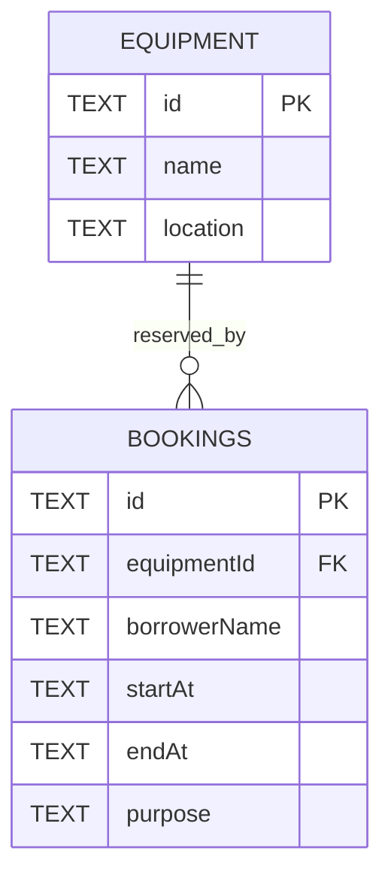

# Data model

`schema.sql` is executable source. All columns are NOT NULL. Foreign keys prevent references to unknown equipment. Start and end are canonical UTC ISO strings, so lexicographic comparisons preserve chronological order. A CHECK requires start < end; application validation rejects impossible calendar values before SQL. An index on equipmentId and times supports conflict checks. INSERT and UPDATE triggers reject overlaps within the write statement. SQLite serializes writes, eliminating a separate check-then-write race. UPDATE excludes its own ID. SQL uses bound parameters for every request value.

Seed records: eq-1 / Projector A / Building 1; eq-2 / Camera B / Media Lab.

Cloudflare D1 uses `migrations/0001_initial.sql`, which contains the same schema and triggers plus equipment seed statements. Apply it separately to local D1 simulation and the remote D1 database. Node-local database files are not uploaded. Worker SQL uses asynchronous `prepare().bind().first()/all()/run()` calls.
